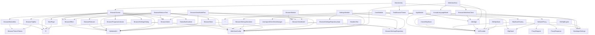

# Project Architecture

```mermaid
graph TD
    AppModule --> BrowserViewModel
    AppModule --> DeveloperSettings
    AppModule --> JsBridge
    AppModule --> UAProvider
    BrowserBottomBar --> BrowserThemeTokens
    BrowserBottomBar --> R
    BrowserEffect --> ValidatedUrl
    BrowserIntent --> ValidatedUrl
    BrowserIntent --> WebViewConfig
    BrowserModule --> BrowserViewModel
    BrowserReducer --> ValidatedUrl
    BrowserReducerTest --> BrowserEffect
    BrowserReducerTest --> BrowserIntent
    BrowserReducerTest --> BrowserReducer
    BrowserReducerTest --> BrowserState
    BrowserReducerTest --> ValidatedUrl
    BrowserReducerTest --> WebViewConfig
    BrowserScreen --> BrowserBottomBar
    BrowserScreen --> BrowserEffect
    BrowserScreen --> BrowserIntent
    BrowserScreen --> BrowserProgressIndicator
    BrowserScreen --> BrowserSettingsDialog
    BrowserScreen --> BrowserTopBar
    BrowserScreen --> BrowserViewModel
    BrowserScreen --> R
    BrowserScreen --> StartPage
    BrowserScreen --> StatusBarGradient
    BrowserScreen --> ValidatedUrl
    BrowserSettingsDialog --> R
    BrowserSettingsDialog --> WebViewConfig
    BrowserSettingsRepositoryImpl --> BrowserSettingsRepository
    BrowserSettingsRepositoryImpl --> WebViewConfig
    BrowserSettingsSerializer --> WebViewConfig
    BrowserState --> ValidatedUrl
    BrowserState --> WebViewConfig
    BrowserTopBar --> BrowserThemeTokens
    BrowserTopBar --> R
    BrowserViewModel --> BrowserSettingsRepository
    BrowserViewModel --> ValidatedUrl
    BrowserViewModelTest --> BrowserEffect
    BrowserViewModelTest --> BrowserIntent
    BrowserViewModelTest --> BrowserSettingsRepository
    BrowserViewModelTest --> BrowserViewModel
    BrowserViewModelTest --> ValidatedUrl
    BrowserViewModelTest --> WebViewConfig
    BrowserWebViewClient --> JsBridge
    BrowserWebViewClient --> NetworkProxy
    BrowserWebViewClient --> UAProvider
    CoreModule --> *
    CoreModule --> DeveloperSettings
    CoreModule --> HttpStack
    CoreModule --> HttpStackFactory
    CoreModule --> UserAgentClientHintsManager
    CronetHttpStack --> UAProvider
    HeadersTest --> WebViewConfig
    HttpStackFactory --> DeveloperSettings
    HttpStackFactory --> UAProvider
    JsBridge --> UAProvider
    MainActivity --> BrowserScreen
    MainActivity --> TestBrowserTheme
    MainActivity --> UAProvider
    NetworkProxy --> HttpStack
    NetworkProxy --> ProxyRequest
    NetworkProxy --> ProxyResponse
    OkHttpEngine --> DeveloperSettings
    OkHttpEngine --> UAProvider
    OkHttpStack --> UAProvider
    SettingsModule --> BrowserSettingsRepository
    SettingsModule --> BrowserSettingsRepositoryImpl
    SettingsModule --> BrowserSettingsSerializer
    SettingsModule --> WebViewConfig
    StartPage --> R
    WebViewHost --> AcceptLanguageMode
    WebViewHost --> BrowserWebViewClient
    WebViewHost --> JsBridge
    WebViewHost --> WebViewConfig
```
