# Project Architecture

```mermaid
graph TB
    %% Root Application Files
    subgraph Root["📱 Application Root"]
        MainActivity["MainActivity.kt"]
    end

    %% Dependency Injection Layer
    subgraph DI["🔧 Dependency Injection"]
        BrowserApp["BrowserApp.kt"]
        AppModule["AppModule.kt"]
        BrowserModule["BrowserModule.kt"] 
        CoreModule["CoreModule.kt"]
        SettingsModule["SettingsModule.kt"]
    end

    %% Presentation Layer (MVI)
    subgraph Presentation["🎨 Presentation Layer"]
        BrowserViewModel["BrowserViewModel.kt"]
        BrowserState["BrowserState.kt"]
        BrowserIntent["BrowserIntent.kt"]
        BrowserEffect["BrowserEffect.kt"]
        BrowserReducer["BrowserReducer.kt"]
        BrowserMode["BrowserMode.kt"]
    end

    %% Domain Layer
    subgraph Domain["🏛️ Domain Layer"]
        subgraph DomainSettings["domain/settings"]
            BrowserSettingsRepository["BrowserSettingsRepository.kt"]
            WebViewConfig["WebViewConfig.kt"]
            RequestedWithHeaderMode["RequestedWithHeaderMode.kt"]
        end
    end

    %% Data Layer
    subgraph Data["💾 Data Layer"]
        subgraph DataSettings["data/settings"]
            BrowserSettingsRepositoryImpl["BrowserSettingsRepositoryImpl.kt"]
            BrowserSettingsSerializer["BrowserSettingsSerializer.kt"]
        end
    end

    %% Core Components
    subgraph Core["⚡ Core Layer"]
        SmartBypass["SmartBypass.kt"]
        SmartBypassEvents["SmartBypassEvents.kt"]
        SmartBypassInterceptor["SmartBypassInterceptor.kt"]
        ValidatedUrl["ValidatedUrl.kt"]
    end

    %% Settings
    subgraph Settings["⚙️ Settings"]
        DeveloperSettings["DeveloperSettings.kt"]
    end

    %% Network Layer
    subgraph Network["🌐 Network Layer"]
        HttpStackFactory["HttpStackFactory.kt"]
        HttpStack["HttpStack.kt"]
        OkHttpEngine["OkHttpEngine.kt"]
        OkHttpClientProvider["OkHttpClientProvider.kt"]
        CronetHttpStack["CronetHttpStack.kt"]
        CronetHolder["CronetHolder.kt"]
        ChromeHeaderSanitizer["ChromeHeaderSanitizer.kt"]
        ProxyRequest["ProxyRequest.kt"]
        ProxyResponse["ProxyResponse.kt"]
        UserAgentClientHintsManager["UserAgentClientHintsManager.kt"]
        UserAgentProvider["UserAgentProvider.kt"]
    end

    %% UI Browser Layer
    subgraph UIBrowser["🖥️ UI Browser Layer"]
        BrowserScreen["BrowserScreen.kt"]
        WebViewController["WebViewController.kt"]
        NetworkProxy["NetworkProxy.kt"]
        NetworkProxySmartBypass["NetworkProxySmartBypass.kt"]
        UAProvider["UAProvider.kt"]
        ChromeUAProvider["ChromeUAProvider.kt"]
        AndroidVersionProvider["AndroidVersionProvider.kt"]
        VersionProvider["VersionProvider.kt"]
        
        subgraph UIComponents["ui/browser/components"]
            BrowserTopBar["BrowserTopBar.kt"]
            BrowserBottomBar["BrowserBottomBar.kt"]
            BrowserSettingsDialog["BrowserSettingsDialog.kt"]
            StartPage["StartPage.kt"]
        end
        
        subgraph UIController["ui/browser/controller"]
            RealWebViewController["RealWebViewController.kt"]
        end
        
        subgraph UIWebView["ui/browser/webview"]
            WebViewSetupManager["WebViewSetupManager.kt"]
            WebViewConfigurer["WebViewConfigurer.kt"]
            RequestedWithHeaderManager["RequestedWithHeaderManager.kt"]
            RequestInterceptionLogger["RequestInterceptionLogger.kt"]
        end
    end

    %% WebView Layer
    subgraph WebView["📱 WebView Layer"]
        BrowserWebViewClient["BrowserWebViewClient.kt"]
    end

    %% JavaScript Bridge
    subgraph JS["📜 JavaScript Layer"]
        JsBridge["JsBridge.kt"]
    end

    %% App Entry Flow
    MainActivity --> BrowserScreen
    MainActivity --> UAProvider

    %% DI Configuration
    BrowserApp -.-> AppModule
    BrowserApp -.-> BrowserModule
    BrowserApp -.-> CoreModule
    BrowserApp -.-> SettingsModule

    %% Presentation Flow
    BrowserScreen --> BrowserViewModel
    BrowserViewModel --> BrowserState
    BrowserViewModel --> BrowserIntent
    BrowserViewModel --> BrowserEffect
    BrowserViewModel --> BrowserReducer
    BrowserViewModel --> BrowserSettingsRepository

    %% UI to Controller Flow
    BrowserScreen --> WebViewController
    WebViewController --> RealWebViewController

    %% WebView Setup Flow
    WebViewController --> WebViewSetupManager
    WebViewSetupManager --> WebViewConfigurer
    WebViewSetupManager --> RequestedWithHeaderManager
    WebViewSetupManager --> BrowserWebViewClient
    WebViewSetupManager --> RequestInterceptionLogger

    %% SmartBypass Decision Path
    NetworkProxySmartBypass --> SmartBypassInterceptor
    SmartBypassInterceptor --> SmartBypass
    SmartBypass --> SmartBypassEvents
    SmartBypass --> ValidatedUrl

    %% Proxy Fetch Path
    NetworkProxySmartBypass --> NetworkProxy
    NetworkProxy --> HttpStackFactory
    HttpStackFactory --> HttpStack
    HttpStackFactory --> OkHttpEngine
    HttpStackFactory --> CronetHttpStack
    OkHttpEngine --> OkHttpClientProvider
    CronetHttpStack --> CronetHolder

    %% Network Proxy Dependencies
    NetworkProxy --> ChromeHeaderSanitizer
    NetworkProxy --> ProxyRequest
    NetworkProxy --> ProxyResponse
    NetworkProxy --> UserAgentClientHintsManager
    NetworkProxy --> UserAgentProvider

    %% Service Worker Coverage (mirrors SmartBypass path)
    WebViewSetupManager --> NetworkProxySmartBypass

    %% Settings & Repository Flow
    BrowserSettingsRepository --> BrowserSettingsRepositoryImpl
    BrowserSettingsRepositoryImpl --> BrowserSettingsSerializer

    %% Settings Influences (dashed for configuration)
    DeveloperSettings -.-> NetworkProxySmartBypass
    DeveloperSettings -.-> WebViewConfigurer
    DeveloperSettings -.-> BrowserViewModel
    WebViewConfig -.-> RequestedWithHeaderManager

    %% JavaScript Bridge
    JsBridge --> UAProvider
    JsBridge --> WebViewController

    %% WebView Client Integration
    BrowserWebViewClient --> NetworkProxy
    BrowserWebViewClient --> JsBridge
    BrowserWebViewClient --> UAProvider

    %% UA Provider Chain
    ChromeUAProvider --> UAProvider
    ChromeUAProvider --> VersionProvider
    AndroidVersionProvider --> VersionProvider

    %% UI Component Relationships
    BrowserScreen --> BrowserTopBar
    BrowserScreen --> BrowserBottomBar
    BrowserScreen --> BrowserSettingsDialog
    BrowserScreen --> StartPage

    %% Visual Styling
    classDef rootLayer fill:#e1f5fe,stroke:#01579b,stroke-width:2px
    classDef diLayer fill:#f3e5f5,stroke:#4a148c,stroke-width:2px
    classDef presentationLayer fill:#e8f5e8,stroke:#1b5e20,stroke-width:2px
    classDef domainLayer fill:#fff3e0,stroke:#e65100,stroke-width:2px
    classDef dataLayer fill:#fce4ec,stroke:#880e4f,stroke-width:2px
    classDef coreLayer fill:#f1f8e9,stroke:#33691e,stroke-width:2px
    classDef settingsLayer fill:#fff8e1,stroke:#ff6f00,stroke-width:2px
    classDef networkLayer fill:#e0f2f1,stroke:#00695c,stroke-width:2px
    classDef uiLayer fill:#e3f2fd,stroke:#0d47a1,stroke-width:2px
    classDef webviewLayer fill:#fafafa,stroke:#424242,stroke-width:2px
    classDef jsLayer fill:#f9fbe7,stroke:#827717,stroke-width:2px

    class MainActivity rootLayer
    class BrowserApp,AppModule,BrowserModule,CoreModule,SettingsModule diLayer
    class BrowserViewModel,BrowserState,BrowserIntent,BrowserEffect,BrowserReducer,BrowserMode presentationLayer
    class BrowserSettingsRepository,WebViewConfig,RequestedWithHeaderMode domainLayer
    class BrowserSettingsRepositoryImpl,BrowserSettingsSerializer dataLayer
    class SmartBypass,SmartBypassEvents,SmartBypassInterceptor,ValidatedUrl coreLayer
    class DeveloperSettings settingsLayer
    class HttpStackFactory,HttpStack,OkHttpEngine,OkHttpClientProvider,CronetHttpStack,CronetHolder,ChromeHeaderSanitizer,ProxyRequest,ProxyResponse,UserAgentClientHintsManager,UserAgentProvider networkLayer
    class BrowserScreen,WebViewController,NetworkProxy,NetworkProxySmartBypass,UAProvider,ChromeUAProvider,AndroidVersionProvider,VersionProvider,BrowserTopBar,BrowserBottomBar,BrowserSettingsDialog,StartPage,RealWebViewController,WebViewSetupManager,WebViewConfigurer,RequestedWithHeaderManager,RequestInterceptionLogger uiLayer
    class BrowserWebViewClient webviewLayer
    class JsBridge jsLayer
```

## Legend
- **Solid arrows (→)**: Direct dependencies/usage/calls
- **Dashed arrows (-.->)**: Configuration/DI influences
- **Vertical layout**: Entry points at top, network stacks at bottom
- **Subgraphs**: Organized by folder structure for clarity
