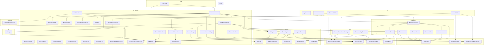

# Project Architecture


```mermaid
graph TD
    %% Layer groupings (subgraphs)
    subgraph DI
        AppModule
        CoreModule
        SettingsModule
        BrowserModule
    end

    subgraph Core
        ValidatedUrl
        DeveloperSettings
        UserAgentClientHintsManager
    end

    subgraph Domain
        BrowserSettingsRepository
        WebViewConfig
        AcceptLanguageMode
        EngineMode
    end

    subgraph Data
        BrowserSettingsRepositoryImpl
        BrowserSettingsSerializer
    end

    subgraph Presentation
        BrowserViewModel
        BrowserState
        BrowserIntent
        BrowserEffect
        BrowserReducer
        BrowserMode
    end

    subgraph JS
        JsBridge
    end

    subgraph Network
        HttpStack
        OkHttpStack
        CronetHttpStack
        HttpStackFactory
        OkHttpClientProvider
        ProxyRequest
        ProxyResponse
        CronetHolder
        UserAgentClientHintsManager
    end

    subgraph UI_Browser[UI - Browser]
        BrowserScreen
        BrowserBottomBar
        BrowserTopBar
        BrowserProgressIndicator
        BrowserSettingsDialog
        StartPage
        StatusBarGradient
        WebViewHost
        WebViewController
        WebViewDebug
        FileUploadHandler
        DownloadHandler
        ProxyValidator
        ProxySmokeTest
        JsCompatScriptProvider
        NetworkProxy
        DefaultNetworkProxy
        RequestedWithHeaderMode
        ChromeCompatibilityInjector
        UAProvider
        ChromeUAProvider
        AndroidVersionProvider
        VersionProvider
    end

    subgraph WebViewLayer[WebView]
        BrowserWebViewClient
    end

    subgraph Settings
        DeveloperSettings
    end

    subgraph App
        MainActivity
    end

    %% Data Layer relations
    BrowserSettingsRepositoryImpl --> BrowserSettingsRepository
    BrowserSettingsRepositoryImpl --> WebViewConfig
    BrowserSettingsSerializer --> WebViewConfig

    %% Domain usages
    BrowserState --> WebViewConfig
    BrowserState --> ValidatedUrl
    BrowserIntent --> ValidatedUrl
    BrowserIntent --> WebViewConfig
    BrowserEffect --> ValidatedUrl
    BrowserReducer --> ValidatedUrl

    %% ViewModel dependencies
    BrowserViewModel --> BrowserSettingsRepository
    BrowserViewModel --> ValidatedUrl
    BrowserViewModel --> BrowserReducer
    BrowserViewModel --> BrowserState

    %% DI provisioning
    BrowserModule --> BrowserViewModel
    BrowserModule --> UAProvider
    BrowserModule --> NetworkProxy
    BrowserModule --> JsCompatScriptProvider
    CoreModule --> DeveloperSettings
    CoreModule --> UserAgentClientHintsManager
    CoreModule --> BrowserSettingsRepositoryImpl
    SettingsModule --> BrowserSettingsRepository

    %% JS Bridge dependency
    JsBridge --> UAProvider

    %% Network dependencies
    OkHttpStack --> UAProvider
    OkHttpStack --> UserAgentClientHintsManager
    CronetHttpStack --> UAProvider
    CronetHttpStack --> UserAgentClientHintsManager
    HttpStackFactory --> DeveloperSettings
    HttpStackFactory --> UAProvider
    HttpStackFactory --> UserAgentClientHintsManager
    DefaultNetworkProxy --> WebViewConfig
    DefaultNetworkProxy --> UAProvider
    DefaultNetworkProxy --> UserAgentClientHintsManager
    DefaultNetworkProxy --> OkHttpStack
    DefaultNetworkProxy --> CronetHttpStack
    NetworkProxy --> HttpStack

    %% WebView client dependencies
    BrowserWebViewClient --> NetworkProxy
    BrowserWebViewClient --> JsBridge
    BrowserWebViewClient --> UAProvider

    %% UI dependencies
    BrowserScreen --> BrowserViewModel
    BrowserScreen --> BrowserIntent
    BrowserScreen --> BrowserEffect
    BrowserScreen --> BrowserSettingsDialog
    BrowserScreen --> BrowserBottomBar
    BrowserScreen --> BrowserTopBar
    BrowserScreen --> StartPage
    BrowserScreen --> BrowserProgressIndicator
    BrowserScreen --> StatusBarGradient
    BrowserSettingsDialog --> WebViewConfig
    WebViewHost --> BrowserWebViewClient
    WebViewHost --> WebViewConfig
    WebViewHost --> JsBridge

    %% App entry
    MainActivity --> BrowserScreen
    MainActivity --> UAProvider

    %% Misc relationships
    JsCompatScriptProvider --> JsBridge
    ChromeUAProvider --> UAProvider
    AndroidVersionProvider --> VersionProvider

    %% Styling / Theme tokens (simplified)
    StatusBarGradient --> WebViewConfig
```
````
