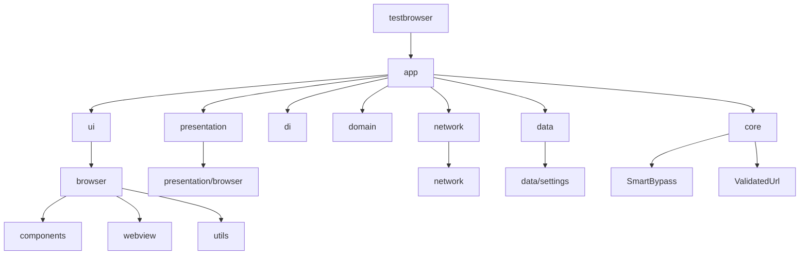

# Project Files Diagram

```mermaid
graph TD
    root[testbrowser]
    root --> app
    app --> core
    app --> data
    app --> di
    app --> domain
    app --> network
    app --> presentation
    app --> ui
    ui --> browser
    browser --> components
    browser --> webview
    browser --> utils
    presentation --> browserState["presentation/browser"]
    network --> http["network"]
    data --> settings["data/settings"]
    core --> SmartBypass
    core --> ValidatedUrl
```
